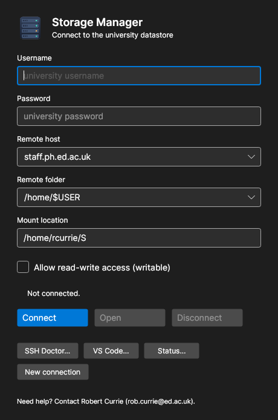
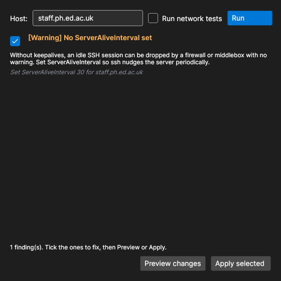
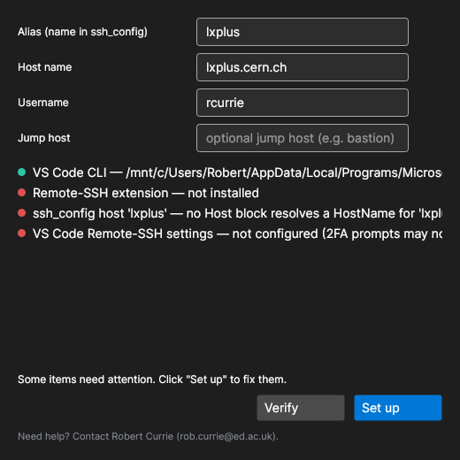
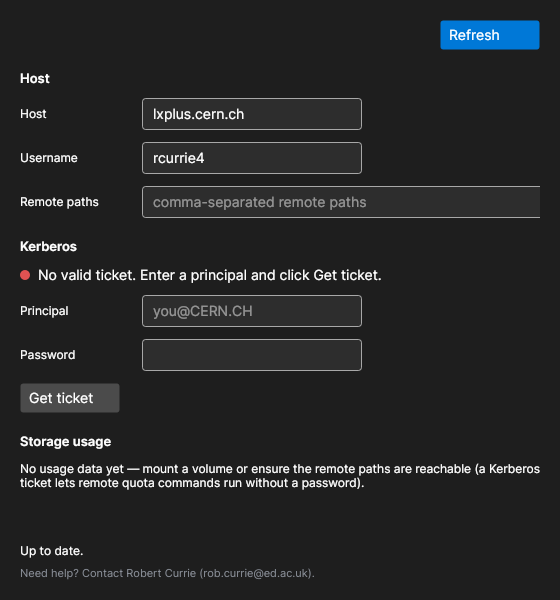

# Storage Manager

**Website: https://rob-c.github.io/StorageManager/** · [Download](https://github.com/rob-c/StorageManager/releases/latest)

Cross-platform tool (Windows / macOS / Linux) that mounts university storage
(Edinburgh PPE datastores, CERN lxplus AFS/EOS, and more) over SSHFS after
prompting for a university username and password. Replaces `script.ps1`.

Mount target: `S:` on Windows, `~/S` on macOS and Linux.

## Screenshots

| Mount | SSH Doctor |
|---|---|
|  |  |
| **VS Code setup** | **Storage & Auth status** |
|  |  |

*(Generated by `tools/Screenshots` — see [CONTRIBUTING](CONTRIBUTING.md).)*

## Interfaces

- **GUI** — the default when you double-click the app (always used on Windows).
- **Terminal UI** — run `StorageManager` in a terminal on macOS/Linux (or force it
  with `--tui`); a guided Spectre.Console flow for headless/SSH sessions.
- **SSH Doctor** — `StorageManager --doctor [host]` audits `~/.ssh/config` for
  keepalive, jump-host, DPI-resilience, and security foot-guns. Flags: `--json`,
  `--probe` (active network tests), `--dry-run` (show the diff), `--fix` (apply,
  writing a timestamped backup first). Also available as a button in the GUI and
  a menu entry in the TUI. Exit codes: 0 clean, 1 findings, 2 error.
- **VS Code remote setup** — `StorageManager --vscode [alias]` verifies (and with
  `--setup` configures) VS Code for remote development: installs the Remote
  Development extensions via the `code` CLI, writes an `~/.ssh/config` Host block
  (with `ProxyJump` for jump hosts, backed up first), and sets the Remote-SSH
  keys — notably `remote.SSH.showLoginTerminal` so password/2FA prompts appear.
  Describe the target with `--host`, `--user`, `--jump`. Also a "VS Code…" button
  in the GUI and a TUI menu entry.
- **Storage & Auth status** — `StorageManager --status [host]` shows Kerberos ticket
  state and storage usage/quota in one place. It can obtain a ticket
  (`--kinit <principal>`, runs `kinit`+`aklog`) and reports per-path quotas for
  the mounted volume and remote AFS/EOS paths (`--paths a,b,c`, `--user`,
  `--mount`). Remote quotas are read over SSH — a Kerberos ticket lets those run
  without a password. Also a "Status…" button in the GUI and a TUI menu entry.
- `StorageManager --diagnostics` prints a redacted support bundle; `--help` lists all.

## Support

Need help? Contact **Robert Currie** (rob.currie@ed.ac.uk). The contact also
appears in the app window, the TUI, `--help`, and the diagnostics bundle.

## Features

- **Mounts read-only by default for safety** — files can't be changed or deleted
  by accident. Tick "Allow read-write access" (GUI) or answer the read-write
  prompt (TUI) to enable writing; the connected status line shows the mode.
- Remembers your username, host, folder, and mount location between runs
  (never the password) — stored under `StorageManager/settings.json` in your
  per-user config directory.
- Checks the server is reachable before mounting and, if not, tells you to
  connect to the VPN rather than showing a raw error.
- Translates sshfs/ssh failures into plain language (wrong password, missing
  folder, host-key change, timeout…).
- One-click prerequisite install on Windows (winget) and copyable install
  commands on macOS/Linux.
- Reconnect after a dropped mount (re-enter only the password), live free-space
  display, editable "Other…" host/folder entries, system-tray minimize, and
  multiple simultaneous mounts via "New connection".

## Download

Grab the latest binary for your platform from the [Releases](../../releases)
page — no .NET install needed, they're self-contained:

- `StorageManager-win-x64.exe` (Windows)
- `StorageManager-linux-x64` (Linux)
- `StorageManager-osx-x64` / `StorageManager-osx-arm64` (macOS)

Verify against `SHA256SUMS.txt` published with each release.

## Building

Requires the .NET 8+ SDK. `./publish.sh` produces standalone single-file
binaries in `dist/` for win-x64, osx-arm64, osx-x64, and linux-x64 — copy the
relevant file to users, nothing else to install for the tool itself. Set
`SIGN=1` (see `docs/SIGNING.md`) to code-sign/notarize the output.

Releases are automated: pushing a `vX.Y.Z` tag triggers
`.github/workflows/release.yml`, which builds all four platforms and attaches
them (plus checksums) to a GitHub Release.

## License

[GPL-3.0](LICENSE). © Robert Currie and contributors.

## Repository layout

- `src/StorageManager.Core` — all logic (config, mounting, connectivity, settings,
  diagnostics, SSH Doctor engine); no UI dependency, fully unit-tested.
- `src/StorageManager` — the executable: GUI, TUI, and CLI front-ends.
- `tests/StorageManager.Core.Tests` — xUnit tests (`dotnet test`).

## Runtime prerequisites (one-time, per machine)

- **Windows:** [WinFsp](https://winfsp.dev/rel/) then
  [SSHFS-Win](https://github.com/winfsp/sshfs-win/releases)
- **macOS:** `brew install macfuse` and `brew install gromgit/fuse/sshfs-mac`
  (macFUSE needs one-time approval in System Settings → Privacy & Security)
- **Linux:** `sudo apt install sshfs` / `sudo dnf install fuse-sshfs`

The app detects a missing sshfs and shows these instructions itself.

## Configuration

Defaults are compiled in. To override, place `mount-config.json` beside the
executable:

```json
{ "gateway": "staff.ph.ed.ac.uk", "remotePath": "/storage/datastore-group/PPE", "mountTarget": null }
```

`mountTarget` optionally overrides the drive letter (Windows) or mount
directory (macOS/Linux).

## First-run notes for users

- Windows SmartScreen: "More info" → "Run anyway" (binary is unsigned; see
  `docs/SIGNING.md` to remove this).
- macOS Gatekeeper: right-click the app → Open, first time only.

## Design & plans

- `docs/superpowers/specs/2026-07-10-cross-platform-sshfs-mounter-design.md` — original design
- `docs/superpowers/specs/2026-07-12-StorageManager-features-and-ssh-doctor-design.md` — features + SSH Doctor design
- `docs/superpowers/plans/2026-07-12-StorageManager-features-and-ssh-doctor.md` — implementation plan
- `docs/SIGNING.md` — code-signing / notarization process
